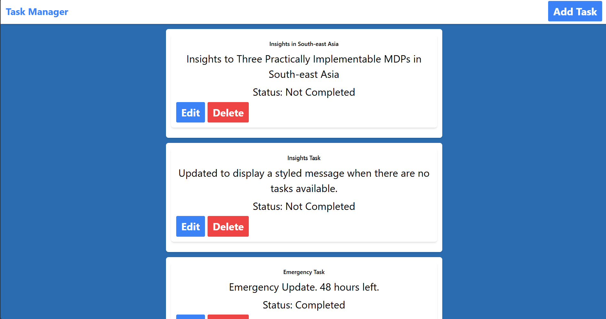
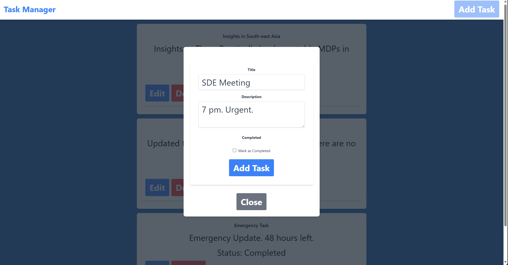

# React Task Management Web App

[![Contributors][contributors-shield]][contributors-url]
[![Forks][forks-shield]][forks-url]
[![Stargazers][stars-shield]][stars-url]
[![Issues][issues-shield]][issues-url]
[![MIT License][license-shield]][license-url]
[![LinkedIn][linkedin-shield]][linkedin-url]

<!-- TABLE OF CONTENTS -->
<details open="open">
  <summary>Table of Contents</summary>
  <ol>
    <li><a href="#description">Description</a></li>
    <li><a href="#features">Features</a></li>
    <li><a href="#screenshots">Screenshots</a></li>
    <li><a href="react-front-end-installation">Front-end Installation</a></li>
    <li><a href="nodejs-back-end-installation">Back-end Installation</a></li>
    <li><a href="#usage">Usage</a></li>
    <li><a href="#roadmap">Roadmap</a></li>
    <li><a href="#contributing">Contributing</a></li>
    <li><a href="#license">License</a></li>
    <li><a href="#contact">Contact</a></li>
    <li><a href="#acknowledgements">Acknowledgements</a></li>
  </ol>
</details>


## Description
This project is a task management web application built using React.js for the front end. It allows users to manage tasks, including adding, editing, and deleting tasks via a RESTful API backend.

## Features
- View a list of current tasks.
- Add new tasks using a dialog.
- Edit existing tasks.
- Delete tasks.
- Feedback messages for task operations.


## Built With

* [React.js](https://reactjs.org/): Front-end framework for building user interfaces.
* [Node.js](https://nodejs.org/): Backend environment for running the API server.
* [Express](https://expressjs.com/): Web framework for Node.js used in handling API requests.
* [MongoDB](https://www.mongodb.com/): NoSQL database used for storing task data.
* [Mongoose](https://mongoosejs.com/): Object Data Modeling (ODM) library for MongoDB and Node.js.
* [RESTful API](https://restfulapi.net/): API architecture for CRUD operations (Create, Read, Update, Delete) on tasks.
* [Axios](https://axios-http.com/): Promise-based HTTP client for making requests to the backend API.


## Screenshots

Screenshot 1: Task List view



Screenshot 2: Add Task dialog




## React Front-end Installation

1. Clone the repo
   ```sh
   git clone [https://github.com/Khalid-Syfullah/React-Task-Management-Web-App-Assignment.git](https://github.com/Khalid-Syfullah/React-Task-Management-Web-App-Assignment.git)


2. Change directory to task manager React front-end
   ```sh
   cd task-manager

3. Install dependencies
   ```sh
   npm install

4. Run web project
   ```sh
   npm run


## React Back-end Installation

1. Clone the repo
   ```sh
   git clone [https://github.com/Khalid-Syfullah/React-Task-Management-Web-App-Assignment.git](https://github.com/Khalid-Syfullah/React-Task-Management-Web-App-Assignment.git)


2. Change directory to task manager Node.js back-end
   ```sh
   cd backend

3. Install dependencies
   ```sh
   npm install

4. Run Nodejs project using npm scripts
   ```sh
   npm start

5. Or run  Nodejs project using node command
   ```sh
   node server.js


<!-- ROADMAP -->
## Roadmap

See the [open issues](https://github.com/khalid-syfullah/react-task-management-web-app-assignment/issues) for a list of proposed features (and known issues).


<!-- CONTRIBUTING -->
## Contributing

1. Fork the Project
2. Create your Branch (`git checkout -b khalid-syfullah/react-task-management-web-app-assignment`)
3. Commit your Changes (`git commit -m 'Add some Changes'`)
4. Push to the Branch (`git push origin khalid-syfullah/react-task-management-web-app-assignment`)
5. Open a Pull Request


<!-- LICENSE -->
## License

Distributed under the MIT License. See `LICENSE` for more information.


<!-- CONTACT -->
## Contact

Your Name - [@khalid_syfullah](https://twitter.com/khalid_syfullah) - khalidsyfullah@gmail.com

Project Link: [https://github.com/khalid-syfullah/boimela](https://github.com/khalid-syfullah/react-task-management-web-app-assignment)


<!-- ACKNOWLEDGEMENTS -->
## Acknowledgements
* [Choose an Open Source License](https://choosealicense.com)
* [GitHub Pages](https://pages.github.com)

[contributors-shield]: https://img.shields.io/static/v1?label=Contributors&message=2&color=red
[contributors-url]: https://github.com/khalid-syfullah//react-task-management-web-app-assignment/graphs/contributors 
[forks-shield]: https://img.shields.io/static/v1?label=Forks&message=1&color=green
[forks-url]: https://github.com/khalid-syfullah/react-task-management-web-app-assignment/network/members
[stars-shield]: https://img.shields.io/static/v1?label=Stars&message=1&color=blue
[stars-url]: https://github.com/khalid-syfullah/react-task-management-web-app-assignment/stargazers
[issues-shield]: https://img.shields.io/static/v1?label=Issues&message=0&color=yellow
[issues-url]: https://github.com/khalid-syfullah/react-task-management-web-app-assignment/issues
[license-shield]: https://img.shields.io/static/v1?label=Licenses&message=0&color=purple
[license-url]: https://github.com/khalid-syfullah/react-task-management-web-app-assignment/blob/master/LICENSE.txt
[linkedin-shield]: https://img.shields.io/static/v1?label=LinkedIn&message=Khalid-Syfullah&logo=linkedin
[linkedin-url]: https://bd.linkedin.com/in/khalid-syfullah
